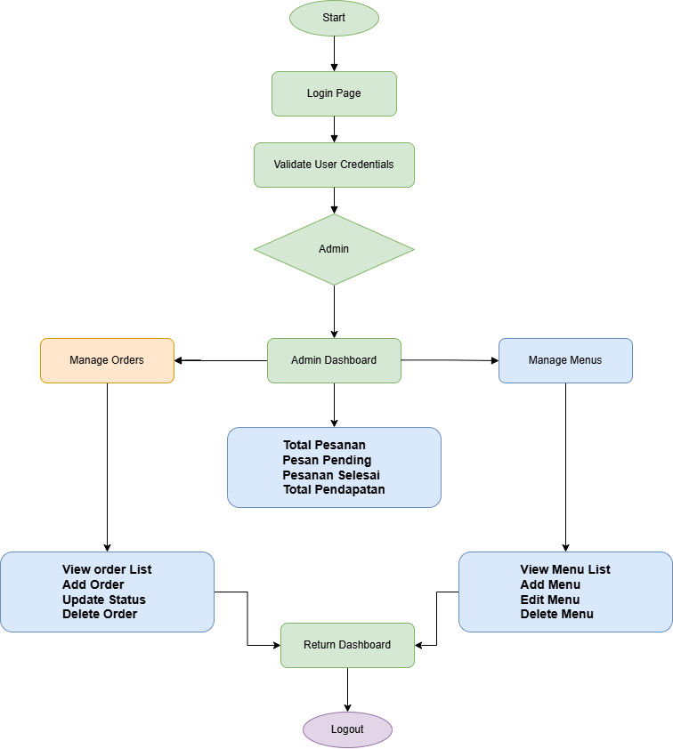

# 🍽️ Website Restoran - Sistem Manajemen Restoran

## 📋 Deskripsi Proyek

**Website Restoran** adalah aplikasi web full-stack untuk manajemen restoran yang dirancang dengan arsitektur modern. Sistem ini memungkinkan administrator restoran untuk mengelola menu, menerima dan memproses pesanan pelanggan, serta melakukan operasi CRUD (Create, Read, Update, Delete) lengkap dengan antarmuka yang intuitif.

### ✨ Fitur Utama

#### 🔐 Autentikasi & Otorisasi

- Login admin dengan sistem keamanan berbasis JWT (JSON Web Token)
- Password di-hash menggunakan bcrypt untuk keamanan maksimal
- Protected routes untuk halaman admin

#### 🍕 Manajemen Menu

- **CRUD Menu Lengkap**: Tambah, lihat, edit, dan hapus menu
- **Kategorisasi**: Menu dikelompokkan menjadi Makanan, Minuman, Dessert, dan Snack
- **Upload Gambar**: Setiap menu dapat memiliki foto produk
- **Status Ketersediaan**: Tandai menu sebagai tersedia atau tidak tersedia
- **Pagination**: Tampilan menu dengan sistem halaman untuk performa optimal
- **Search & Filter**: Cari menu berdasarkan nama dan filter berdasarkan kategori

#### 📦 Manajemen Pesanan (Order)

- **Buat Pesanan Baru**: Pilih multiple menu dengan jumlah yang diinginkan
- **Daftar Pesanan**: Lihat semua pesanan dengan detail lengkap
- **Detail Order**: Tampilkan item pesanan, harga satuan, jumlah, dan total
- **Update Status**: Ubah status pesanan dari pending ke selesai
- **Otomatis Kalkulasi**: Total harga dihitung otomatis berdasarkan item dan jumlah
- **Catatan Pesanan**: Tambahkan catatan khusus untuk setiap pesanan

#### 🎨 User Interface

- **Responsive Design**: Tampilan optimal di desktop, tablet, dan mobile
- **Modern UI/UX**: Menggunakan Tailwind CSS untuk desain yang bersih dan profesional
- **Loading States**: Indikator loading untuk pengalaman pengguna yang lebih baik
- **Notifications**: Sistem notifikasi untuk feedback operasi (success/error)
- **Smooth Navigation**: Routing yang smooth dengan Vue Router

---

## 🏗️ Arsitektur Sistem

### Tech Stack

#### 🔧 Backend

- **Framework**: Flask 3.0.0 (Python)
- **Database**: MySQL 8.0+
- **ORM**: SQLAlchemy 2.0.23
- **Authentication**: Flask-JWT-Extended
- **Security**: bcrypt, python-dotenv
- **CORS**: Flask-CORS untuk komunikasi frontend-backend
- **Image Processing**: Pillow (PIL)

#### 🎨 Frontend

- **Framework**: Vue.js 3.5.25
- **Build Tool**: Vite 7.2.4
- **Routing**: Vue Router 4.6.3
- **HTTP Client**: Axios 1.13.2
- **Styling**: Tailwind CSS 4.1.17
- **CSS Processing**: PostCSS + Autoprefixer

### Struktur Database

# 🗄️ **Database Schema**


## 📊 **Sistem Architecture**



---

### 🔑 **Admin Account**

```json
{
  "username": "admintesting",
  "password": "qwerty123"
}
```

```json
{
  "username": "admintesting1",
  "password": "qwerty123"
}
```

## 🚀 Cara Setup dan Menjalankan Proyek

### Prasyarat

Pastikan terinstal di sistem Anda:

- **Python 3.8+** ([Download](https://www.python.org/downloads/))
- **Node.js 18+** dan npm ([Download](https://nodejs.org/))
- **MySQL 8.0+** ([Download](https://dev.mysql.com/downloads/mysql/))
- **Git** (opsional, untuk clone repository)

---

## 📦 SETUP DATABASE

### 1. Buat Database MySQL

```bash
# Login ke MySQL
mysql -u root -p

# Jalankan script database.sql
source /path/to/database.sql

# Atau copy-paste isi file database.sql ke MySQL terminal
```

Atau jalankan langsung melalui MySQL Workbench/phpMyAdmin:

- Buka file `database.sql`
- Execute script tersebut

Script akan membuat:

- Database `restorandb`
- 4 tabel (admins, menus, orders, order_items)
- Data dummy: 2 admin, 40 menu (10 per kategori), 3 sample orders

### 2. Konfigurasi Database (Opsional)

Jika menggunakan konfigurasi MySQL non-default, buat file `.env` di folder `back-end/`:

```bash
# back-end/.env
DB_HOST=localhost
DB_USER=root
DB_PASSWORD=your_mysql_password
DB_NAME=restorandb
DB_PORT=3306
```

---

## 🔧 SETUP BACKEND

### 1. Masuk ke Folder Backend

```bash
cd back-end
```

### 2. Buat Virtual Environment (Recommended)

**Windows:**

```bash
python -m venv venv
venv\Scripts\activate
```

### 3. Install Dependencies

```bash
pip install -r requirements.txt
```

Ini akan menginstal semua package yang diperlukan:

- Flask, Flask-CORS, Flask-JWT-Extended
- SQLAlchemy, PyMySQL
- bcrypt, Pillow, dll.

### 4. (Opsional) Buat Admin Baru

Jika ingin membuat admin selain yang ada di data dummy:

```bash
python create_admin.py
```

Ikuti prompt untuk input:

- Username
- Password (minimal 6 karakter)
- Nama Lengkap

### 5. Jalankan Backend Server

```bash
python start.py
```

Server akan berjalan di: **http://localhost:5000**

**Endpoint API:**

- `GET /`: Health check
- `POST /auth/login`: Login admin
- `GET /menus`: Daftar menu (dengan pagination & filter)
- `POST /menus`: Tambah menu baru
- `PUT /menus/<id>`: Update menu
- `DELETE /menus/<id>`: Hapus menu
- `GET /orders`: Daftar pesanan
- `POST /orders`: Buat pesanan baru
- `GET /orders/<id>`: Detail pesanan
- `PUT /orders/<id>`: Update status pesanan

---

## 🎨 SETUP FRONTEND

### 1. Buka Terminal Baru & Masuk ke Folder Frontend

```bash
cd front-end
```

### 2. Install Dependencies

```bash
npm install
```

Ini akan menginstal:

- Vue.js 3, Vue Router
- Vite (build tool)
- Axios (HTTP client)
- Tailwind CSS (styling)

### 3. Jalankan Development Server

```bash
npm run dev
```

Frontend akan berjalan di: **http://localhost:5173**

### 4. Build untuk Production (Opsional)

```bash
npm run build
```

File production akan dihasilkan di folder `dist/`

---

## 🎯 CARA MENGGUNAKAN APLIKASI

### 1. Akses Aplikasi

Buka browser dan navigasi ke: **http://localhost:5173**

### 2. Login Admin

Gunakan kredensial default:

- **Username**: `admintesting`
- **Password**: `qwerty123`

### 3. Kelola Menu

Dari dashboard:

- Klik **Menu List** untuk melihat semua menu
- Gunakan **Search** dan **Filter** untuk mencari menu
- Klik **Add New Menu** untuk menambah menu baru
- Klik tombol **Edit** pada menu untuk mengubah data
- Klik tombol **Delete** untuk menghapus menu

### 4. Kelola Pesanan

Dari dashboard:

- Klik **Order List** untuk melihat semua pesanan
- Klik **New Order** untuk membuat pesanan baru
- Pilih menu dan tentukan jumlahnya
- Isi nama customer dan catatan (opsional)
- Total harga akan dihitung otomatis
- Klik **View Details** untuk melihat detail pesanan
- Update status dari "Pending" ke "Selesai"

---

## 🔒 Keamanan

- **Password Hashing**: Menggunakan bcrypt dengan salt untuk hash password
- **JWT Authentication**: Token-based authentication untuk API
- **CORS Protection**: Dikonfigurasi untuk mencegah unauthorized access
- **SQL Injection Protection**: SQLAlchemy ORM dengan parameterized queries
- **File Upload Validation**: Pembatasan ukuran dan tipe file untuk upload gambar
